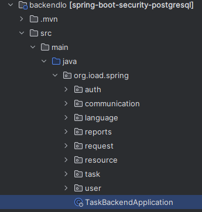

**PL**
# System-koordynacji-pomocy-humanitarnej-SKPH-
Ostateczna wersja programu znajduje się w branchu master.
System jest dostępny w języku polskim i angielskim.

**Dokumentacja**  
Dokumentacja składa się z dokumentacji technicznej oraz podręcznika użytkownika.
[📄 Pobierz dokumentacje](System%20koordynacji%20pomocy%20humanitarnej.pdf)

**EN**
# System for Humanitarian Aid Coordination
Finished project is located on master branch.
System supports polish and english language.

**Documentation**  
Documentation consists of technical documentation and a user guide.
[📄 Download documentation](System%20koordynacji%20pomocy%20humanitarnej.pdf) (*polish language only*)  

**PL**  
*Opis*  
Celem projektu było stworzenie systemu informatycznego wspomagającego koordynację działań pomocowych podczas sytuacji kryzysowych, takich jak klęski żywiołowe czy katastrofy ekologiczne. System ma umożliwić sprawne zarządzanie zgłoszeniami poszkodowanych, dystrybucję zasobów, komunikację pomiędzy wszystkimi zaangażowanymi stronami oraz monitorowanie i raportowanie stanu akcji pomocowych. Dążyliśmy do zbudowania platformy, która będzie narzędziem wsparcia dla organizacji pomocowych, wolontariuszy, darczyńców, poszkodowanych oraz przedstawicieli władz.  

**EN**  
*Description*  
The goal of the project was to create an IT system to support the coordination of aid efforts during crisis situations, such as natural disasters or ecological catastrophes. The system is designed to enable efficient management of victim reports, resource distribution, communication between all involved parties, and monitoring and reporting on the status of aid operations. Our aim was to build a platform that serves as a support tool for aid organizations, volunteers, donors, victims, and government representatives.

**PL**
# Wymagania systemu:
- Java 21
- Maven
- Vue.js 3
- Spring Boot
- JavaScript
- Node.js, npm
- baza danych PostgreSQL o nazwie: testdbb

username oraz hasło bazy danych należy podmienić w pliku 'application.properties'
inserty ról użytkowników do bazy danych znajdują się w pliku README.md w branchu master

**Uruchomienie systemu:**
1. Włączenie backendu - plik 'TaskBackendApplication':
   

2. Włączenie frontendu - komenda 'npm run dev' będąc w folderze 'ioFrontend\frontendio'

**EN**

# System Requirements:
- Java 21
- Maven
- Vue.js 3
- Spring Boot
- JavaScript
- Node.js, npm
- PostgreSQL database named: testdbb
The database username and password must be updated in the 'application.properties' file.
User role inserts for the database can be found in the README.md file in the master branch.

**System Startup:**

1. Start the backend - file 'TaskBackendApplication':

2. Start the frontend - run the command 'npm run dev' while in the folder 'ioFrontend\frontendio'

# Contributors
- [247659](https://github.com/247659)  
- [247806](https://github.com/247806)
- [Ceendi](https://github.com/Ceendi)  
- [dawid36980](https://github.com/dawid36980)
- [FdotP](https://github.com/FdotP)  
- [jruszer](https://github.com/jruszer)  
- [KacperFTIMS](https://github.com/KacperFTIMS)  
- [KacperWitek](https://github.com/KacperWitek)
- [MatMichalec](https://github.com/MatMichalec)
- [natalianykiel](https://github.com/natalianykiel)
- [patryksalyga](https://github.com/patryksalyga)
- [stejzy](https://github.com/stejzy)
- [venomiakk](https://github.com/venomiakk)
- [wzelechowski](https://github.com/wzelechowski)

*System architects:*
- [LyczkoLukasz](https://github.com/LyczkoLukasz)
- [WiktorGlaner](https://github.com/WiktorGlaner)

